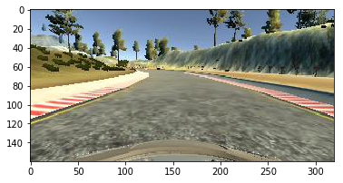

# Udacity-Self-Driving-Car-Behavioural_Cloning(P3)

**Project: Behavioural Cloning.**

In this project I have built and trained deep neural network to enable a car to drive itself around the racing track in a driving simulator. The starting model is a convolutional neural network based on the [NVDIA](https://arxiv.org/pdf/1704.07911.pdf) architecture.

The project is organised by the following sections:
* Loading Data
* Data Preprocessing and Augmentation
* Design and Test Model Architecture
* Model Improvement
* Testing and Results

## Project structure

|      File       |               Description                                                                                            |
|---------------- |----------------------------------------------------------------------------------------------------------------------|
|   'model.py'    | main script, implements and trains deep neural network for end-to-end autonomous driving.                            |              
|   'model.h5'    | model weights                                                                                                        |
|   'drive.py'    | implements driving simulator callbaks, communicates with the driving simulator.                                      |

## Loading Data
The simulator has two tracks, one of which was used to collect the training data, the other (unseen) track is effectively the test set enabling to test model generalization properties (the ability to drive on unseen terrain).

The driving simulator saves images coming from three front-facing (left, central and right) cameras, as well as various driving variables such as steering angle, speed, breaking and throttle. The objective is to predict the steering angle in the range [-1,+1] based on frontal cameras images.

The model is that of ''behavioural cloning'', the deep neural net learns to emulate the behaviour of human drivers by learning the relationship betweeen images coming from the frontal cameras and the steering angle. The model ''learns from data'' by deciding which features of terrain, road markings are important without involvement of human engineers.

## Data Preprocessing and Augmentation
The training data set contained 10,881 images coming from three cameras. Using images from all three front-facing cameras allows to augment the training data set, however one has to account for the fact that when using front-left and front-right cameras, the steering angle should be corrected accorginly as follows:

* steering_left = steering_center + correction
* steering_right = steering_center - correction
 
Additionally, images and steering measurements were flipped, this allowed to obtain yet more data and to mitigate the effects of the left turn bias (as the car was run counter-clockwise).

The images were of the size 160 x 320 x 3, storing 10,000 such images would take over 1.5Gb memory with preprocessing (resulting in changing data type from int to float) this could take up to 6Gb memory. To address this issue, generator was implemented which allows to pull data (instead of keeping all data in the memory) and process them on the fly as and when they are needed. This is much more memory efficient and also allows of effective parallel use of CPU and GPUs.

The models (explaned below) were trained both with and wihtout the generator, checking the performance model performance and also time taken to train the models.

## Design and Test Model Architecture

Two versions of the model architectures were examined, one based on a variation from LeCun's [LeNet](http://yann.lecun.com/exdb/lenet/), the other one based on the [NVDIA](https://arxiv.org/pdf/1704.07911.pdf) architecture. Both models were based on the convolutional neural network architecture.

The LeNet architecture model was (Keras code):

model = Sequential() 
model.add(Lambda(lambda x: (x/255.0) - 0.5, input_shape = (160, 320,3)))  
model.add(Cropping2D(cropping = ((70,25),(0,0)))) 
model.add(Convolution2D(6,5,5, activation = 'relu')) 
model.add(MaxPooling2D()) 
model.add(Convolution2D(6,5,5, activation = 'relu')) 
model.add(MaxPooling2D()) 
model.add(Flatten()) 
model.add(Dense(120)) 
model.add(Dense(84)) 
model.add(Dense(1)) 

The modified NVDIA architecture was (Keras code):

model = Sequential() 
model.add(Lambda(lambda x: (x/255.0) - 0.5, input_shape = (160, 320,3))) 
model.add(Cropping2D(cropping = ((70,25),(0,0)))) 
model.add(Convolution2D(24,5,5, subsample = (2,2), activation = 'relu')) 
model.add(Convolution2D(36,5,5, subsample = (2,2), activation = 'relu')) 
model.add(Convolution2D(48,5,5, subsample = (2,2), activation = 'relu')) 
model.add(Convolution2D(64,3,3, activation = 'relu')) 
model.add(Convolution2D(64,3,3, activation = 'relu')) 
model.add(Flatten()) 
model.add(Dense(100, activation='relu')) 
model.add(Dropout(.5)) 
model.add(Dense(50, activation='relu')) 
model.add(Dropout(.5)) 
model.add(Dense(10, activation='relu')) 
model.add(Dense(1)) 

Both architectures used Keras' Lambda layers to allow for effective (parallel) scaling and centering of images for better gradient flowing in the back-propagation for deep learning. In addition images were cropped from above and below to allow deep neural net to focus on the important region of the image, bypassing less relevant details (such as sky, trees etc.).

Both architectures used non-linear ('RELU') activations, to mitigate against overfitting dropout was used - including on the densely connected layers of the modifided NVDIA architecture (NVDIA model was designed for more complicated task of driving in the real scenarios, for simulated driving original NVDIA model could lead to overfittting and droput was used to address this).

## The modified NVDIA architecture

|      Layer      |               Description                | 
| :-------------: | :-------------------------------------- :| 
|      Input      |        160x320x3 RGB image               | 
|      Lambda     |        Scaling, centering                | 
|      Cropping   |        Cropping from above and below     | 
| Convolution 5x5 |        x24, subsample = (2,2), RELU      | 
| Convolution 5x5 |        x36, subsample = (2,2), RELU      | 
| Convolution 5x5 |        x48, subsample = (2,2), RELU      | 
| Convolution 3x3 |        x64, RELU                         | 
| Convolution 3x3 |        x64, RELU                         | 
|      Flatten    |        outputs 100                       | 
|      Flatten    |        outputs 50                        | 
|      Flatten    |        outputs 10                        | 
|      Flatten    |        outputs 1                         | 

The models were trained using Adam optimizer, the perfomance was measured using MSE loss on the training and validation sets. Given correct model architecture, the models train well under 5 epochs depending on the architecture. The models using generator train faster than models storing training data in memory.

## Model Improvement

Model was tested iteratively to obtain good driving results after obtaining good validation data set performance.

## Testing and Results

The manages to drive just well, please see video of autonomouse driving in the project repository.

